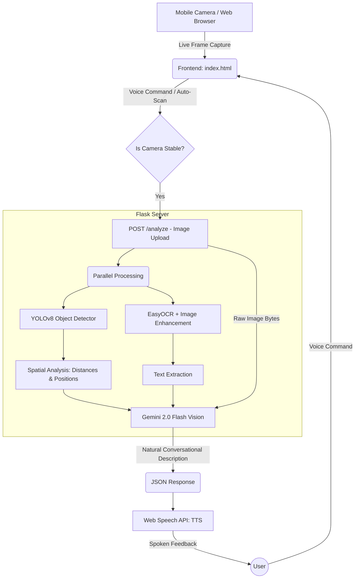

# 👁️ Vision — Smart Visual Scene Explainer for the Visually Impaired

Vision is a high-end, real-time AI assistant designed to help visually impaired individuals understand their surroundings. It combines deep learning object detection, OCR (Optical Character Recognition), and the state-of-the-art Gemini 2.0 Flash model to provide a calm, conversational, and safety-first experience.

---

## 🚀 Key Features

*   **Real-time Scene Analysis**: Uses YOLOv8 Large for high-precision object detection.
*   **Conversational 'Vision' Persona**: Powered by Gemini 2.0 Flash to provide natural, human-like descriptions rather than robotic labels.
*   **Intelligent Distance Estimation**: Uses a physics-based pinhole camera model to estimate object distances in metres.
*   **Safety-First Design**: Automatically prioritizes obstacles and hazards in its descriptions.
*   **Advanced OCR**: Multi-pass text detection with image enhancement (CLAHE) to read signs and labels clearly.
*   **Voice-Interactive**: Full voice command support (Describe, Find, Read, Stop) with instant interruption handling.
*   **Premium Glassmorphism UI**: A sleek, minimalist interface designed for high-end mobile accessibility.

---

## 📊 System Architecture & Flowchart



---

## 🛠️ How It Works

### 1. The Perception Layer (YOLOv8 + EasyOCR)
The system captures high-resolution frames and processes them in parallel:
*   **YOLOv8 (Large)**: Scans the scene for 80+ object classes. It provides bounding boxes used to calculate the relative size of objects.
*   **Spatial Analysis**: By comparing the object's pixel height to known real-world heights (e.g., a bottle is ~25cm, a person is ~170cm), the system estimates the distance in metres using a pinhole camera focal length model.
*   **OCR Preprocessing**: Before reading text, the image is enhanced using **CLAHE (Contrast Limited Adaptive Histogram Equalization)** and sharpening filters to make small or low-light text readable.

### 2. The Reasoning Layer (Gemini 2.0 Flash)
Unlike basic apps that just list objects, Vision sends the **raw image + detected data** to Gemini 2.0 Flash. We use a sophisticated **System Instruction** to define the 'Vision' persona:
*   It avoids repetition (won't say "Bottle" every 10 seconds).
*   It speaks naturally ("To your left, there is a chair about 2 metres away").
*   It prioritizes safety concerns first.

### 3. The Interaction Layer (Web Speech API)
The frontend manages the conversation:
*   **Interim Recognition**: Uses the browser's Speech Recognition with `interimResults: true`. This allows the "STOP" command to work instantly even while the AI is still speaking.
*   **Analysis Collisions**: Each scan has a unique ID. If you move the camera fast, Vision cancels old "thinking" tasks to ensure you only hear about the frame you are looking at *now*.

---

## 💻 Tech Stack

*   **Frontend**: HTML5, CSS3 (Glassmorphism), JavaScript (Vanilla).
*   **Backend**: Python, Flask.
*   **ML Models**: 
    *   **YOLOv8 (Ultralytics)** — Object Detection.
    *   **EasyOCR** — Text Recognition.
    *   **Gemini 2.0 Flash (Google Gen AI)** — Reasoning & Natural Language.
*   **Acceleration**: CUDA 12.4 / RTX GPU Support.
*   **Connectivity**: Ngrok (Secure Tunneling for Mobile).

---

## 🏃 Run the Project

### 1. Prerequisites
*   Python 3.10+
*   NVIDIA GPU (Optional but Recommended)
*   Gemini API Key (Set in `.env`)

### 2. Installation
```powershell
# Clone the repository
git clone <your-repo-link>
cd Smart-Visual-Scene-Explainer-for-Blinds

# Install requirements in the virtual environment
.\venv\Scripts\python.exe -m pip install -r requirements.txt
```

### 3. Starting the AI
Open two terminals:

**Terminal 1 (Flask App):**
```powershell
.\venv\Scripts\python.exe app.py
```

**Terminal 2 (Ngrok Tunnel):**
```powershell
ngrok http 5000
```

---

## 🤝 Contributing
Vision is an open-source project aimed at improving accessibility. Feel free to fork, add new spatial models, or improve the conversational flow!